# VE312 Notes #
---
### Lecture 1：Introduction ###
1. computer architecture
	- computer architecture:  
	control, memory, calculator
	- the first electronic computer:  
	use vacuum tubes: that has grid control (栅极)
2. revolution of transistors:
	- scaling factor: $\lambda = \frac{1}{\sqrt{2}} \approx 0.7$
	- the number doubles every two years
3. benefit of scaling down:
	- low cost
	- high speed
	- low power
4. challenges of scaling down:
	- high power density (heat)
	- leakage current
	- lithography
	- short channel effect ??
	- dopant number fluctuation

--
### Lecture 2: PN Cmos ###
1. Digital Integrated Circuits  

	| factor | p-type | n-type |
	| :---: | :---: | :---: |
	| dopant | B | P |
	| carriers | holes | electrons |
	| charge | -- | + |
	| potential | low | high |
2. PN junctioin
	- IV characteristic
	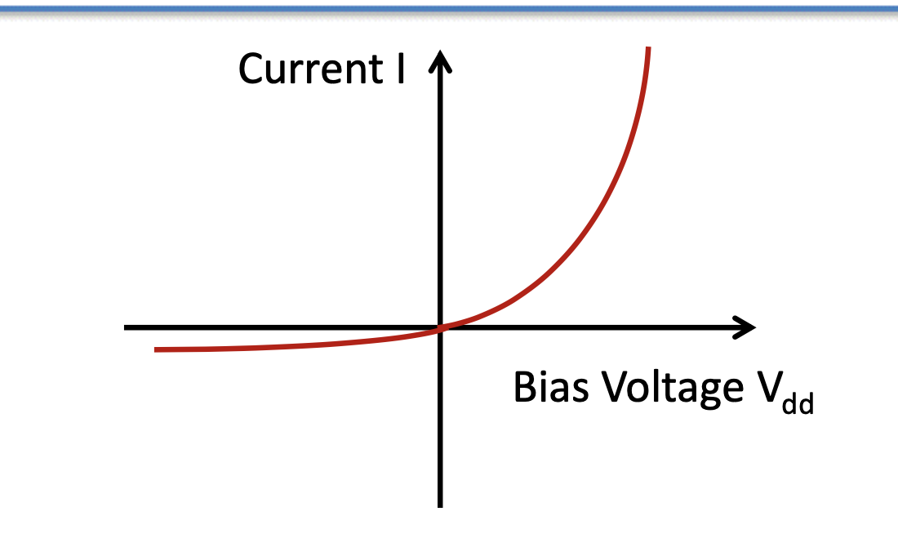
	- current equation:  
	$ I = I_s(e^\frac{V_b}{nkT}-1) $
	- ideal diode model:  
	$ I_D>0 \Longleftrightarrow V_D=V_{on} $  
	$ I_D=0 \Longleftrightarrow V_D<V_{on} $
	
--
### Lecture 3: pnCMos Continue(II) ###
1. MOSFET: metal oxide silicon field effect transistor

	| | pMos | nMos (☑️) |
	| :---: | :---: | :---: |
	| source / drain | p-type | n-type |
	| carrier | holes | electrons |
	| current direction | S$\rightarrow$D | D$\rightarrow$S |
	| voltage | D: grounded, S: $V_{DS}$ | S: grounded, D: $V_{DS}$ |
	| subtrate | n ($V_{DD}$) | p (grounded) |
2. the conditions

	| | pMos | nMos (☑️) |
	| :---: | :---: | :---: |
	| gate voltage | $\le V_{DD}-V_T$ | $\ge V_T$ |
	| saturation condition |  | $V_{DS} > V_{GS} - V_T$ |
2. different nodes are isolated because of the pn junction pair in opposite directions
3. when gate is applied with a high voltage (higher than threshold voltage $V_T$), the capacitance make a local part of p-type silicon to become a n-type silicon which can conduct electrons
4. the gate capacitance:  
	- not uniform, so measured as $C_{ox}$: capacitance per unit area
	- formed charge per unit area: $Q = (V_{GS}-\text{mean}\{V_S,V_D\}-V_T)\times C_{ox}$, where $V_{GS} = |V_G-V_S|$  
	therefore, __$Q = (V_{GS}-\frac{V_{DS}}{2}-V_T)\times C_{ox}$__
5. __For nMosfet__, the current between source and drain:
	- shear resistance:  
	$ R_s = \frac{\rho}{t} = \frac{1}{\mu_nQ_n} $  
	$ R_{DS} = R_s\times\frac{w}{L} = \frac{L / W}{\mu_{n} C_{o x}\left(V_{G S}-V_{T}-\frac{V_{D S}}{2}\right)} $
	- $I_{DS}$: current between source and drain,  
	$= 0$ if $V_{GS}<V_T$  
	$= \frac{V_{DS}}{R_{DS}} = \mu_{n} C_{o x} \frac{W}{L}\left(V_{G S}-V_{T}-\frac{V_{D S}}{2}\right) V_{D S}$ if $V_{GS}\ge V_T$  
6. the condition for saturate drain current
	- current $I_{DS}$ should increase with $V_{DS}$
	- when $V_{DS} \ge V_{GS}-V_T$, $I_{DS}$ would saturate at $\frac{V_{GS}-V_T}{R_{DS}} = \mu_{n} C_{o x} \frac{W}{2L}\left(V_{G S}-V_{T}\right)^2$
	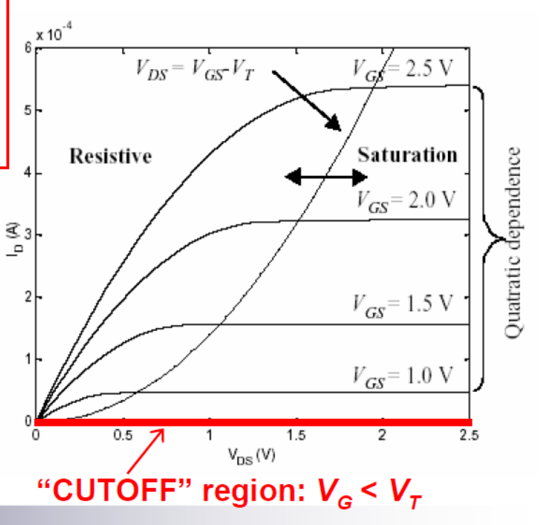
7. the actual dependencies of $I_{DS}$ on $V_{DS}$ and $V_{GS}$
	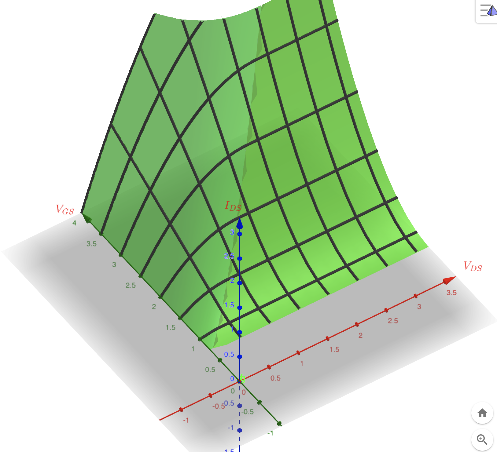
	__A very important property: if we elongate the curve of $V_{GS}$ to intersect with x axis, the intersection would be approximately $V_T$ (when $V_{DS}$ is small)__.

--
### Lecture 4: pnCmos Continue(III) ###
1. enhancement mode vs depletion mode  
	- depletion mode: $V_T < 0$, nMos behaves like pMos
2. conventional positive current flow direction: $\color{red}{\text{from Drain to Source}}$
3. secondary effects:
	- channel-length modulation: $I_D = I_D^\prime (1+\lambda V_{DS})$
	- body effect: when $V_{SB}>0$, threshold voltage would increase:  
		$V_T = V_{T_0}+\gamma (\sqrt{|V_{SB}-2\phi|}-\sqrt{|2\phi|}) $
	- velocity saturation: 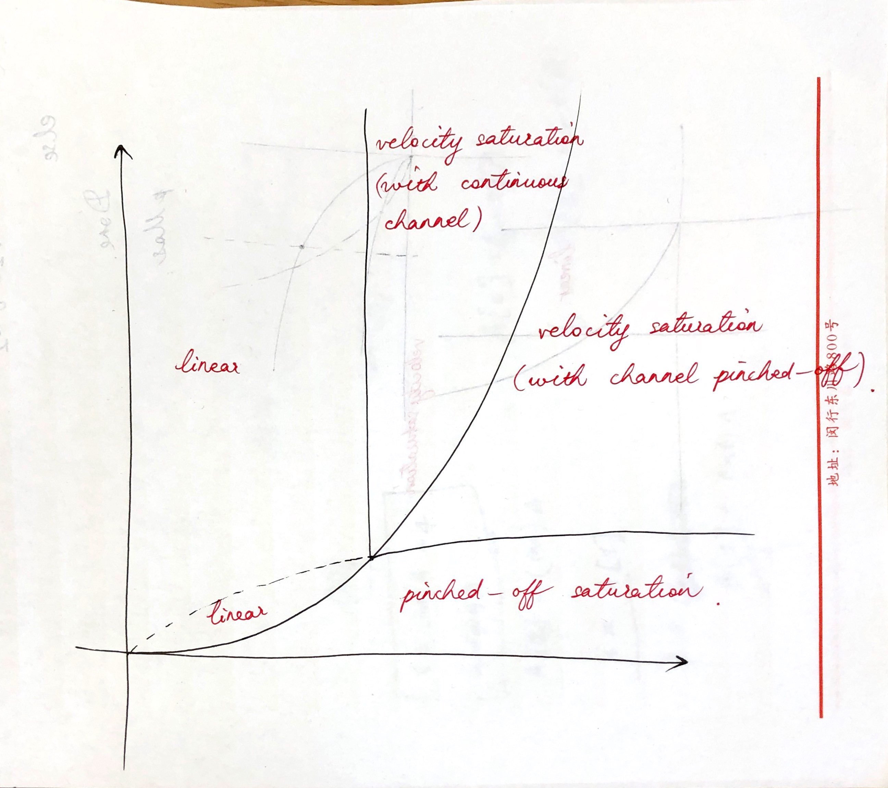
		- $I_D = \mu_{n} C_{o x} \frac{W}{L}\left(V_{G S}-V_{T}-\frac{V_{min}}{2}\right) V_{min}$  
		with:  
			- $V_{min} = \min \{V_{GS}-V_T, V_{DS}, V_{DSAT}\}$  
			- $V_T = V_{T_0}+\gamma (\sqrt{|V_{SB}-2\phi|}-\sqrt{|2\phi|})$

--
### Lecture 5: pnCmos Continue(IV) ###
1. leakage current: ($I_D$ vs $V_{GS}$)
	<table>
		<caption> $I_D$ vs $V_{GS}$ </caption>
		<thead>
			<tr> 
				<th scope="col"> normal scale </th> 
				<th scope="col"> logarithmic scale </th>
			</tr>
		</thead>
		<tbody>
			<tr>
				<td> 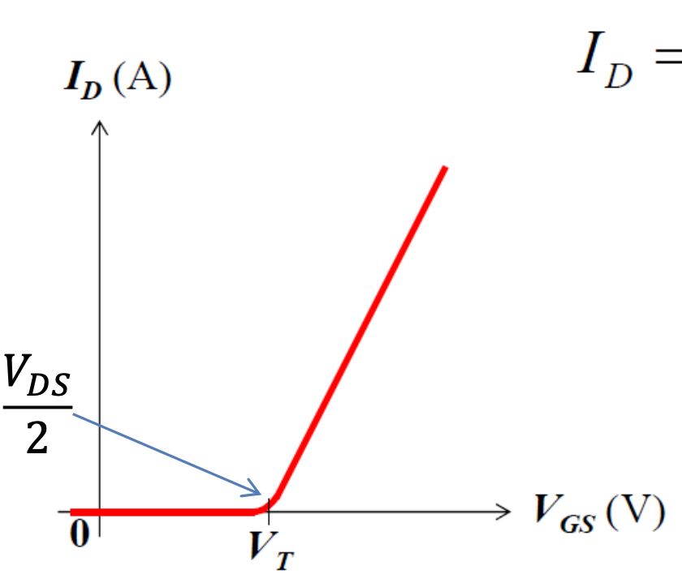 </td>
				<td> 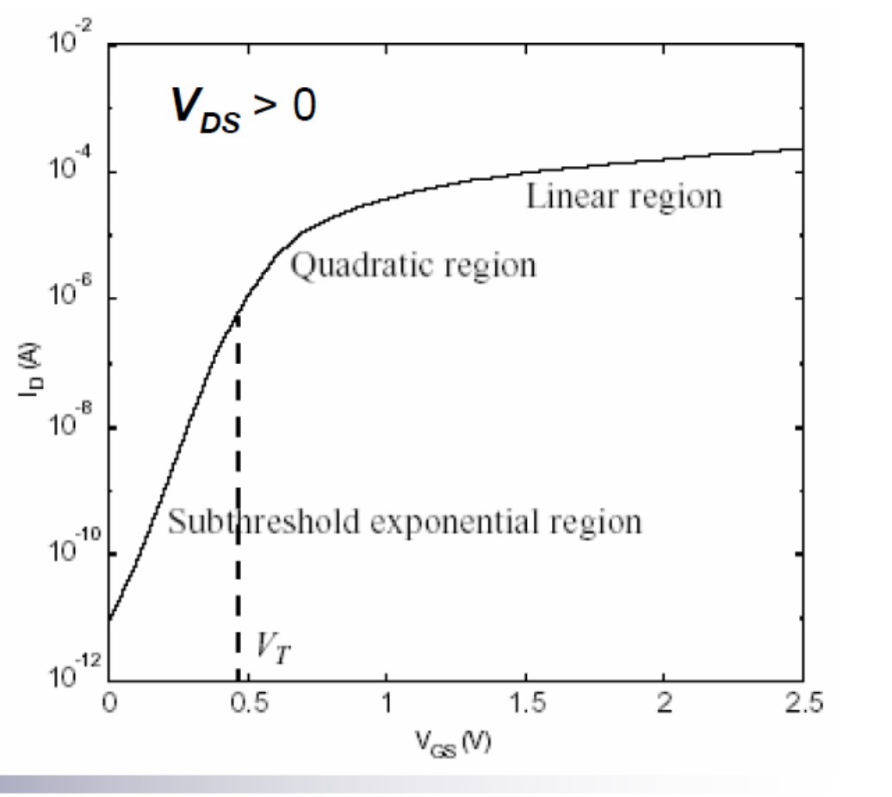 </td>
			</tr>
		</tbody>
	</table>
	- the slope at subthreshold exponential region:
		$\color{red}{\text{slope = }\frac{1}{S}\text{, }S\approx 60\text{ mV/decade}}$, the larger the slope is, the better the cMos is.
2. when nMos is in ON state, it's almost quivalent to a current source.
3. gate capacitance: $\color{red}{C_{gate}=C_{ox} W L}$
	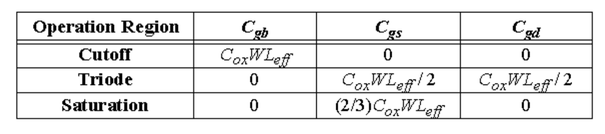

--
### Lecture 6: Manufacture 1 ###
1. cMos:
	- p-substrate for nMos
	- n-well for pMos
	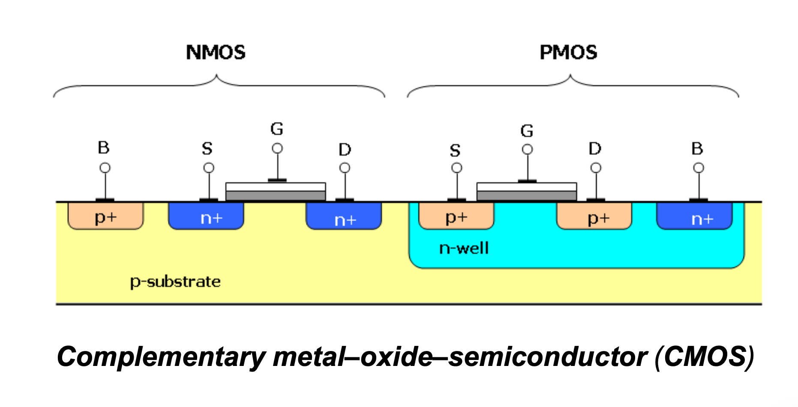
2. how oxide are etched: SiO2 + photoresist + mask + etch + pr remove
3. concrete flows:
	<table>
		<caption> the flow of cMos manifacturing </caption>
		<tbody>
			<tr>
				<td> 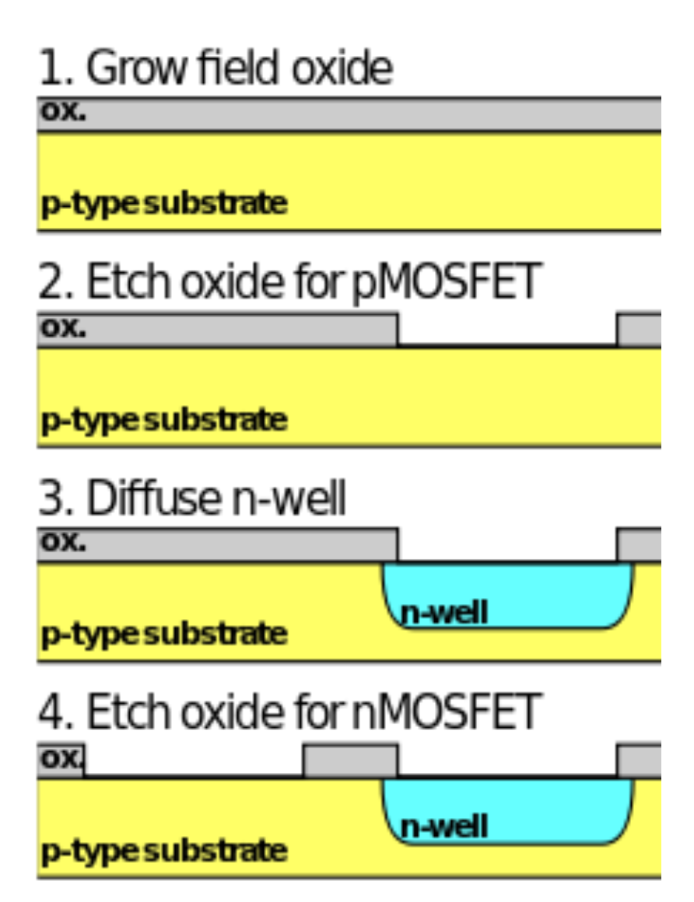 </td>
				<td> 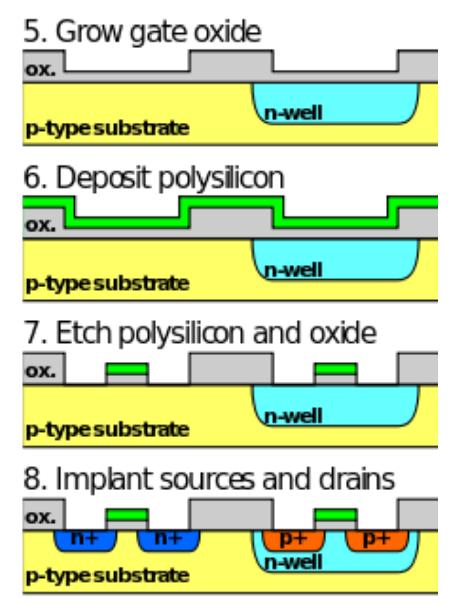 </td>
				<td> 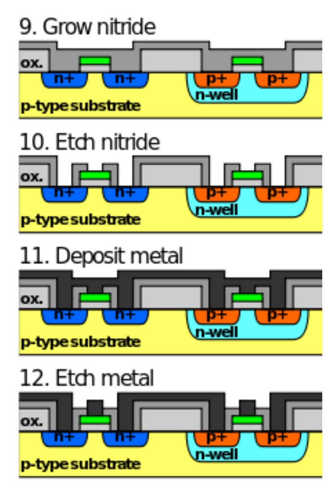 </td>
			</tr>
		</tboday>
	</table>
4. circuit under design:
	- $\color{blue}{\text{blue: metal}}$
	- $\color{green}{\text{green: active region}}$
	- $\color{pink}{\text{pink: n-doped }}$
	- $\color{yellowgreen}{\text{yellow: n-well}}$
	- $\color{purple}{\text{purple: poly silicon}}$
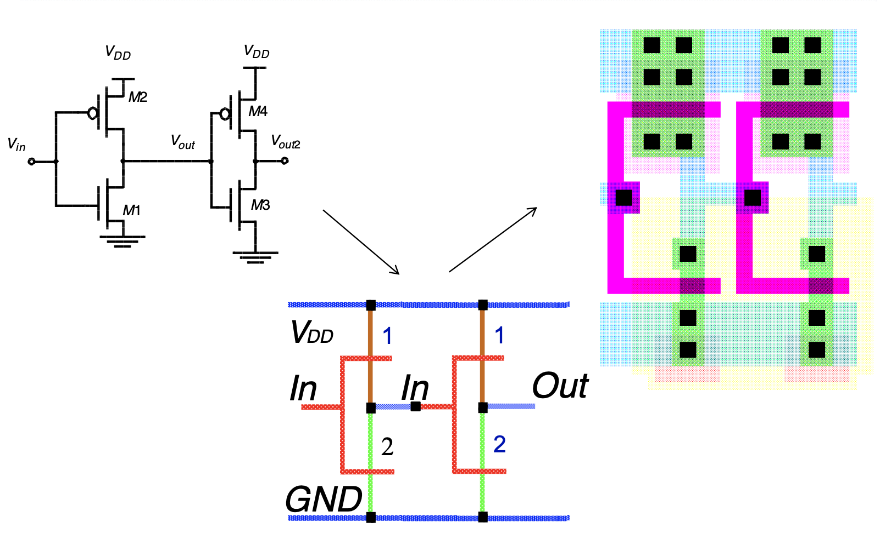
5. silicide: polysilicon + metal $\longrightarrow$ some kind of alloy

--
### Lecture 7: design rules and wires
1. design rules
	- unit dimensions: minimum line width
	- define the rules by:
		- scalable: multiples of unit
		- absolute: microns
2. wires:
	1. interconnect parasitics:
		- the capacitance and resistance affected by different wires
		- ??????

--
### Lecture 8: 
<table>
	<caption> different generations of inverter designs </caption>
	<thead>
		<tr>
			<th> generations </th>
			<th> first generation </th>
			<th> second generation </th>
			<th> current generation </th>
		</tr>
	</thead>
	<tbody>
		<tr>
			<td> diagrams </td>
			<td> 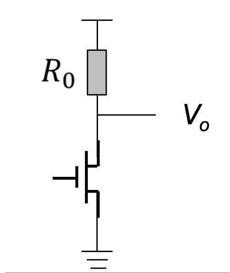 </td>
			<td> 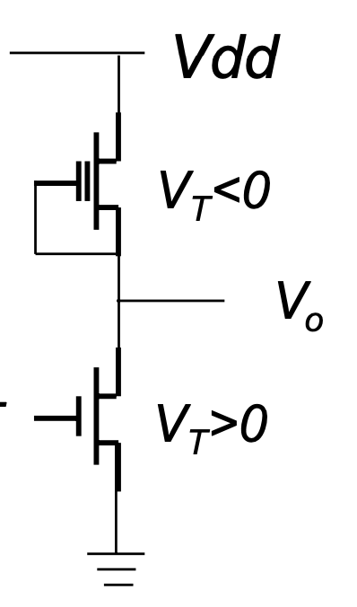 </td>
			<td> 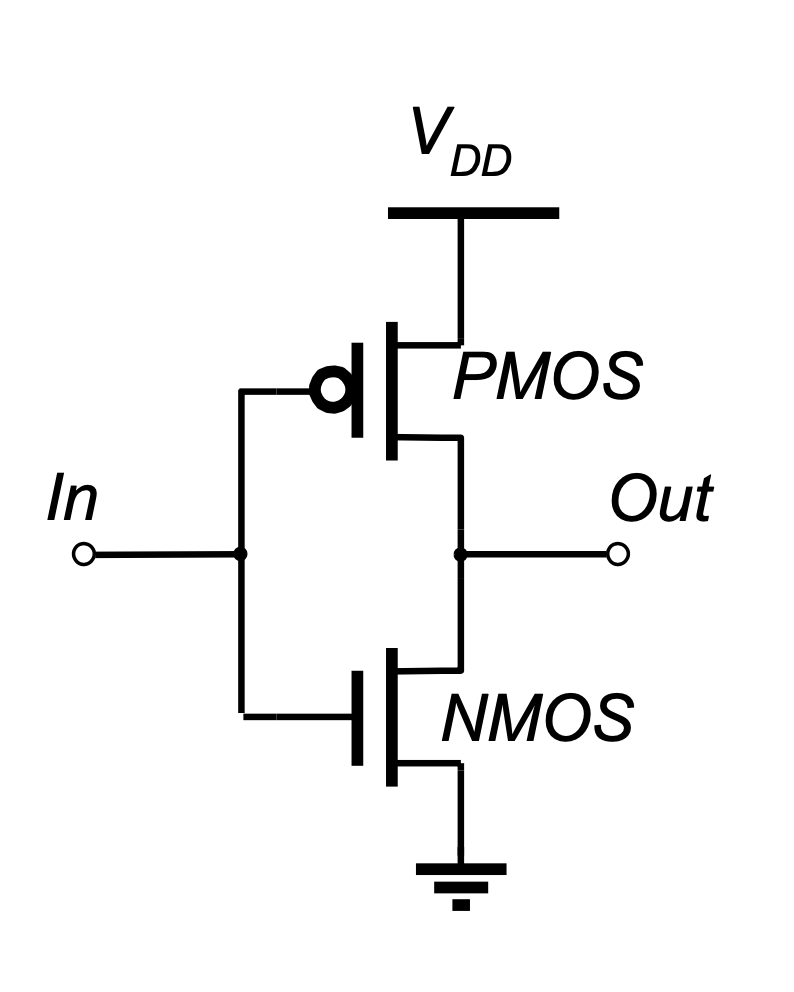 </td>
		</tr>
		<tr>
			<td rowspan="2"> drawbacks </td>
			<td> 1. resistor R0 must be huge (consumes area, and makes the gate slow) </td>
			<td> 1. large equivalent R0 still makes the gate slow </td>
			<td rowspan="2"> NONE </td>
		</tr>
		<tr>
			<td> 2. Vout is not zero, so there would be leakage current in the next level </td>
			<td> 2. there would always stand-by power consumption 3. still exists leakage current </td>
		</tr>
	</tboday>
</table>

--
### Lecture 9: Voltage Transfer Characteristic ###
1. Vin vs Vout for pMos and nMos in the inverter:
	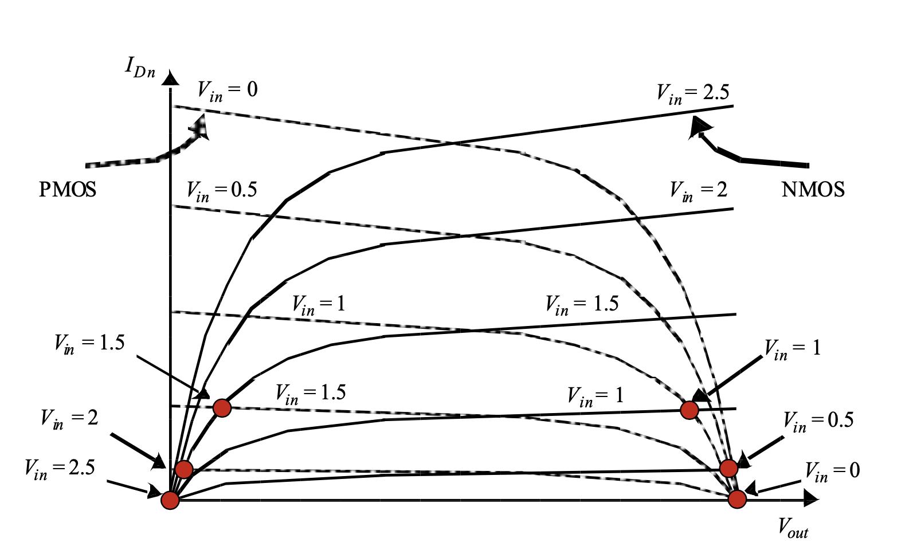
2. IV characteristic curve for inverter:
	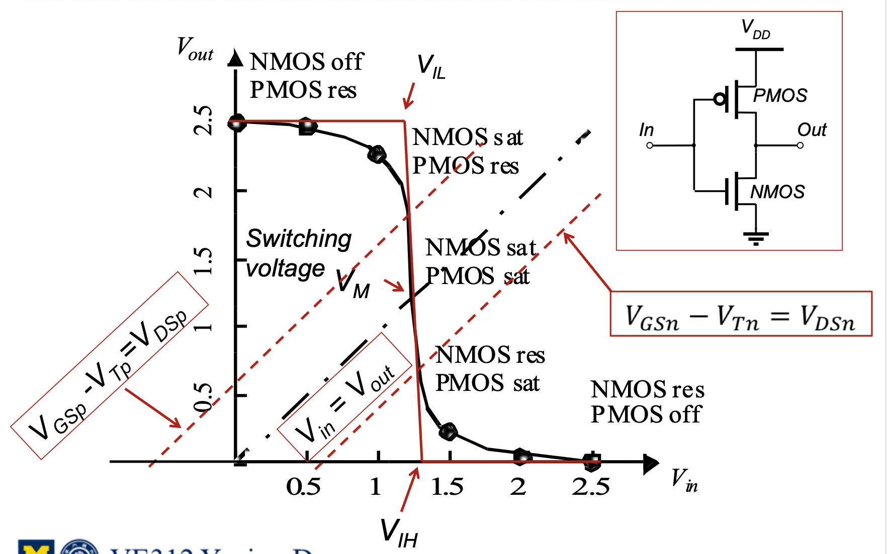
3. noise margin:
	- $\color{red}{\text{Low-End noise margin: }V_{IL} - V_{OL}}$
	- $\color{red}{\text{High-End noise margin: }V_{OH} - V_{IH}}$
4. when both nMos and pMos are in saturation region, we have:
	- $\color{red}{V_{in} = \frac{(V_{DD}+V_{Tp})\sqrt{\frac{k_p}{k_n}}+V_{Tn}}{1+\sqrt{\frac{k_p}{k_n}}}} = [\text{when }k_p = k_n\text{; }V_{Tp} + V_{Tn} = 0] \color{red}{= \frac{V_{DD}}{2}}$
	- note: $k_p = k_n \Leftrightarrow \frac{w_p}{w_n} \approx 2.7$
5. how to find the slope of the oblique line
	- small signal model: 
		- transconductance: $\color{red}{g_m = \frac{dI_d}{dV_g} = \frac{2I_d}{V_{gs} - V_T}}$
		- output impedance: $\color{red}{\frac{1}{r_o} = \frac{dI_d}{dV_{ds}} = \frac{\lambda I_d}{1+\lambda V_{ds}}}$
		
	- inverter small signal model: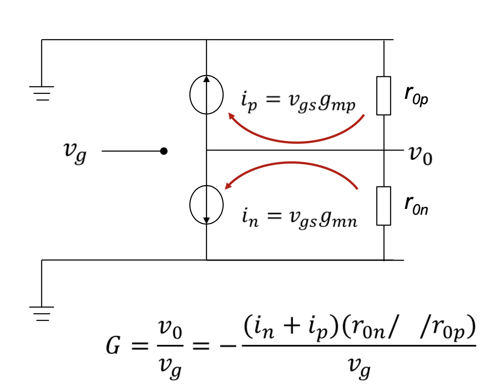
	- to calculate the slope: $\color{red}{V_g = V_{ds} = \frac{V_DD}{2} \longrightarrow I_d \longrightarrow g_m, r_o \longrightarrow G}$

--
### Lecture 10: Propagation Delay ###
1. definition of delay: when the output completes half of the variation
2. calculation of the delay: 
	- assume the cMos is always in saturation region,
	- $Q = I_{sat}t_p = C_L \Delta V$,  
		$\therefore \color{red}{t_p = \frac{V_{DD}C_L}{2I_{sat}}}$
3. factors related to delay: $C_L,\ w$
	- when $\frac{w_p}{w_n}\approx 2$, delay is minimized. ($t_{pLH} > t_{pHL}$)
	- when $\frac{w_p}{w_n}\approx 2.6$, $t_{pHL} = t_{pLH}$
	- note: 
		- here L and H refers to the input signal
		- $C_L$ refers to the output capacitance
		- $I_{sat}$ refers to the input current

--
### Lecture 11: inverter sizing ###
